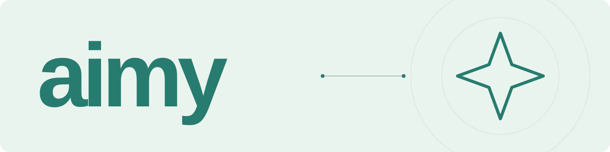
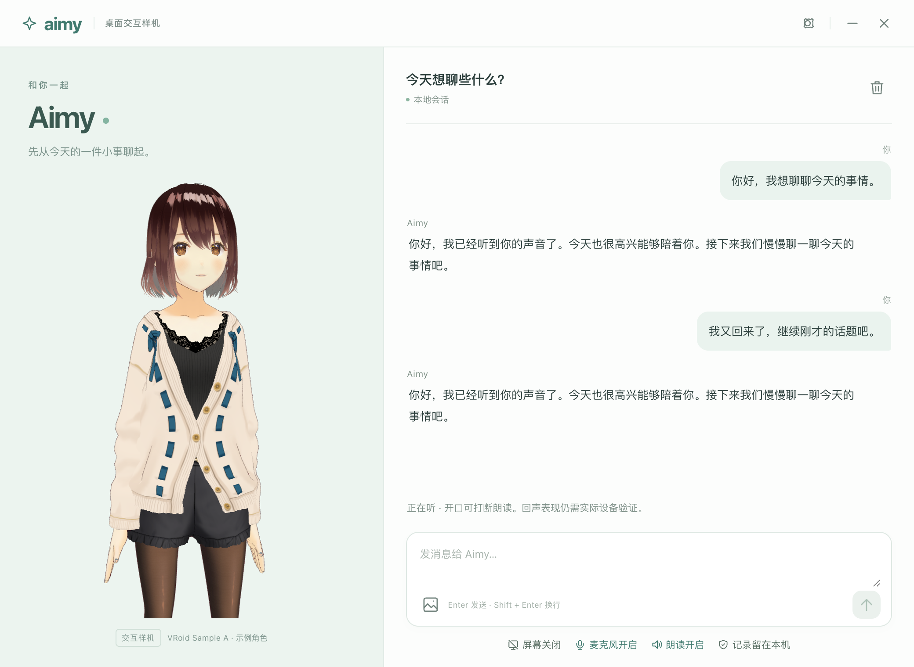
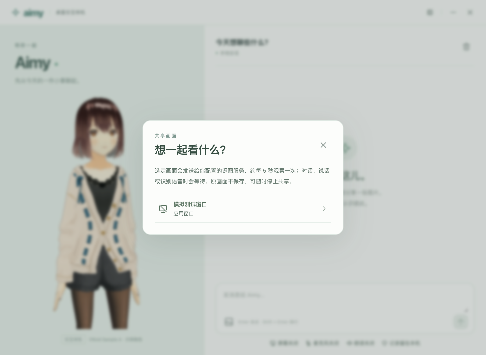

<p align="center">
  <picture>
    <source media="(prefers-color-scheme: dark)" srcset="digital-lover/docs/visual/github/banner-dark.svg">
    
  </picture>
</p>

<p align="center"><strong>先从今天的一件小事聊起。</strong><br>会听、会看、会回应的桌面陪伴原型。</p>

<p align="center">
  
  
  
</p>

<p align="center">
  <a href="#快速开始">快速开始</a> ·
  <a href="digital-lover/docs/真实联调配置说明.md">模型配置</a> ·
  <a href="digital-lover/docs/PROJECT_STATE.md">当前进度</a> ·
  <a href="digital-lover/README.md">开发文档</a>
</p>

---

Aimy 是面向打游戏、看视频与日常交流的**虚拟情感陪伴桌面原型**，基于 AIRI 能力底座二次开发。它把多轮交流、语音与授权画面连接到一个可见的 VRM 角色，探索持续陪伴的体验。

当前为 macOS 源码启动版本，用户自行配置模型服务。文字、图片、语音与看屏原型已经接入；真实模型、设备、回声与自然度仍待验收。完整 MVP、正式角色和安装包尚未交付。


<p align="center"><sub>真实 Electron 窗口 · VRoid Sample A 为示例角色，正式角色后续定稿</sub></p>

## 现在可以体验什么

| 体验 | 当前原型 |
|:---|:---|
| **聊文字，分享图片** | 多轮流式回复，支持停止生成；退出后可恢复会话，也可清空记录。 |
| **用声音交流** | 持续收听与本地 VAD，分段转写进入对话；新语音可打断旧回复，分句朗读并驱动口型。 |
| **一起看画面** | 主动选择单个窗口或屏幕，只共享画面；约 5 秒最多观察一次，忙时和相同帧会跳过。 |
| **掌握开关与数据** | 麦克风、看屏和朗读默认关闭；隐藏、退出或撤销后停止相关流，重启不会自动开启。 |
| **选择自己的模型** | 对话/识图、ASR、TTS 分别配置；凭证由主进程通过 Electron safeStorage 保存。 |

**当前语音是分段 HTTP 原型。** 新确认语音会替换未完成的旧段；原生流式识别、扬声器回声与自然插话仍需实测。聊天记录恢复也不等于长期记忆完成。

<details>
<summary><strong>查看更多原型截图：语音交流与共享画面</strong></summary>

### 语音交流



此场景使用文件假麦克风、本机模拟 ASR/LLM/TTS，以及真实本地 VAD、SDK 和 WebAudio；不代表真实音色或识别质量已通过。

### 选择共享画面



截图中的来源为测试自建窗口。真实桌面来源、系统许可与视觉相关性仍待验收。

</details>

## 快速开始

需要 **macOS、Node.js 24、pnpm 11.24.0**。

```sh
git clone https://github.com/26YZT/aimy.git
cd aimy/digital-lover

pnpm install --frozen-lockfile --ignore-scripts
pnpm setup:desktop
pnpm build:desktop
pnpm start:desktop
```

窗口中打开“模型服务设置”，填写以下能力。密钥直接在本机填写，不放入仓库或反馈截图。

| 设置页 | 需要的能力 |
|:---|:---|
| **对话与识图** | 中文多轮、流式 Chat Completions 或 Responses；图片理解模型与对话共享服务地址、协议及密钥。 |
| **语音识别** | 中文 ASR，兼容 HTTP 转写接口，接收 WAV 并返回 JSON 文本。 |
| **语音合成** | 中文 TTS，兼容 HTTP 合成接口，返回 WAV；另填可用音色 ID。 |

服务配置与采集授权分开：保存配置不会自动调用模型或开启设备。填写细节见 [真实联调配置说明](digital-lover/docs/真实联调配置说明.md)。

## 数据与隐私

- 会话与分享的图片保存在本机；发送时，对话上下文和选定输入交由你配置的模型服务处理。
- 原始录音和屏幕帧默认不长期保存；转写、画面观察文字会进入本地对话。
- 摄像头和电脑自动操作不在当前产品范围，看屏不录系统音频。
- 清空会删除本地消息和分享图片；外部模型服务对已处理内容的留存由其自身政策决定。

详细边界见 [桌面应用说明](digital-lover/apps/aimy-desktop/README.md)。

## 验证与开发路线

截至 **2026-10-07** 的工程与隔离原生结果：

| 自动化测试 | 类型检查 | 原生检查 |
|:---:|:---:|:---:|
| **831 项通过** | **21 个项目通过** | **43 项通过** |

原生检查使用真实 Electron、渲染、SDK 与音频管线，但输入为假设备/自建窗口，模型为本机模拟服务。真实模型、设备和人工体验独立验收，不把测试数字等同于产品完成度。

[工程证据](digital-lover/docs/执行记录/2026-10-07-D工程检查.json) · [实施记录](digital-lover/docs/执行记录/2026-10-07-D实时交互原型.md)

| 阶段 | 交付目标 | 当前进度 |
|:---|:---|:---|
| A · 工程基线 | 依赖、独立入口、日志脱敏与需求基线 | 工程验证通过 |
| B · 关键体验 | 真模型、连续语音、插话、回声与画面反馈 | 等待真实服务和设备验收 |
| C · 桌面切片 | 一个 VRM、多轮文字/图片、取消与恢复 | 样机已实现并通过隔离回归 |
| D · 实时感知 | 语音、授权看屏、口型与隐私控制 | 原型已实现；真实体验待验 |
| E · 连续陪伴 | 主动不打扰、情绪/关系、记忆与受邀试用 | 尚未接入产品链路 |

下一步先完成真实模型和耳机/扬声器/共享源验证，再推进记忆、主动陪伴与安装试用。正式人设、角色与声音并行评审。

## 项目导航

| 想了解什么 | 从这里开始 |
|:---|:---|
| 产品定位与范围 | [PRD](digital-lover/docs/PRD-MVP-重构版.md) |
| 最新进度与下一步 | [PROJECT_STATE](digital-lover/docs/PROJECT_STATE.md) |
| 安装、构建与测试 | [工作区手册](digital-lover/README.md) |
| 桌面进程与数据边界 | [桌面应用](digital-lover/apps/aimy-desktop/README.md) |
| AIRI 复用来源 | [修订记录](digital-lover/docs/AIRI复用修订记录.md) |
| 角色与第三方许可 | [资产清单](digital-lover/docs/资产清单.md) · [第三方来源](THIRD_PARTY_NOTICES.md) |

```text
digital-lover/
├── apps/aimy-desktop/   桌面入口、角色与交互
├── packages/           产品模块与必要运行依赖
├── assets/             示例角色、本地 VAD 与来源记录
└── docs/               需求、路线、实现与验收证据
```

本仓库仅发布 Aimy 及必要运行依赖，完整参考库、旧模板、私人配置、缓存与构建产物均排除。保留已接入的 AIRI 原许可证与来源记录，构建无需完整 `airi-main/`。

欢迎通过 [Issues](https://github.com/26YZT/aimy/issues) 提交可复现问题或体验建议；请注明系统、模型服务和操作步骤，并移除密钥、真实录音和私人画面。

<p align="center"><sub>Aimy · 和你一起，慢慢认识彼此。</sub></p>
