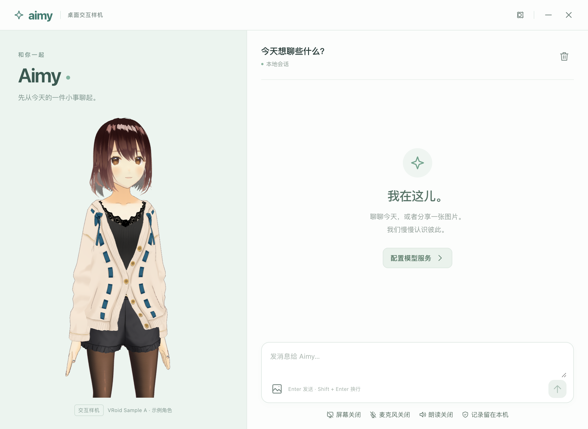

# Aimy

Aimy 是基于 AIRI 能力底座开发的虚拟情感陪伴桌面产品，优先探索打游戏、看视频时的陪伴体验。当前提供 macOS 源码启动原型，角色使用明确标注的 VRoid Sample A。

本仓库只包含 Aimy 产品工作区 `digital-lover/`、必要的运行依赖、资产、许可证和开发文档。完整 AIRI 参考库、Blueprint、旧模板、私人配置、运行数据及依赖缓存不在发布范围内。

## 当前能力

- 多轮流式文字、分享图片、停止生成、重启恢复及清空会话。
- 持续收听、本地 VAD、分段语音识别、新语音打断旧回复、分句朗读与口型。
- 主动选择单个窗口或屏幕进行画面观察；麦克风、看屏和朗读默认关闭。
- 对话/识图、ASR、TTS 分别配置；凭证由主进程通过 Electron safeStorage 保存。

工程验证已通过 831 项测试、21 个类型检查项目及 43 项隔离原生检查。原生检查采用假设备与本机模拟服务；真实模型、真实设备、语音回声、延迟和人工体验仍待验收。长期记忆、主动陪伴、正式角色及安装分发继续开发，完整 MVP 尚未完成。

## 本机启动

需要 macOS、Node.js 24 和 pnpm 11.24.0。

```sh
git clone https://github.com/26YZT/aimy.git
cd aimy/digital-lover
pnpm install --frozen-lockfile --ignore-scripts
pnpm setup:desktop
pnpm build:desktop
pnpm start:desktop
```

在窗口的三个设置页填写自己的对话/识图、中文 ASR、中文 TTS 服务；TTS 另填音色 ID。当前语音适配采用兼容 HTTP 接口，ASR 接收 WAV 并返回 JSON，TTS 返回 WAV。密钥直接在本机填写，不放入仓库。完整参考库不参与构建。

## 文档与验证

- [产品需求](digital-lover/docs/PRD-MVP-重构版.md)
- [当前进度和下一步](digital-lover/docs/PROJECT_STATE.md)
- [模型配置要求](digital-lover/docs/真实联调配置说明.md)
- [完整启动与测试命令](digital-lover/README.md)
- [实时交互实施证据](digital-lover/docs/执行记录/2026-10-07-D实时交互原型.md)
- [第三方来源与许可证](THIRD_PARTY_NOTICES.md)


