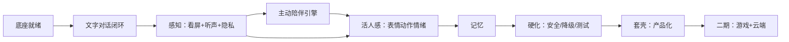

# Aimy 任务编排

> 产品负责人已批准 [PRD-MVP-重构版.md](PRD-MVP-重构版.md) 与 A–E 顺序。此表是工作出口，不宣称相应功能或阶段已完成；最新事实和验证看 PROJECT_STATE。

## 当前顺序与任务出口

| 阶段 | 任务 | 可审阅交付/退出证据 |
|---|---|---|
| A 工程基线 | 工作区类型/测试依赖、CLI 独立入口、provider/日志脱敏、文档一致性、源码与暂存基线 | 全包类型检查及相关测试通过；无配置/模拟流式/错误负例；真实模型单列待验 |
| B 关键体验 | 连续语音、插话、回声、流式播放/口型；游戏/视频画面理解耗时与相关性 | 耳机/扬声器及真实模型/设备结果；可行性、耗时与剩余缺口；假设备不替代真实验收 |
| C 桌面切片 | 一个 VRM、入口/配置、多轮文字/图片、取消、恢复 | 用户可走完；断网、取消旧输出、缺资源与新进程恢复有效 |
| D 实时感知 | B 结论集成、连续语音/插话、授权看屏、声音/表情/动作/口型及隐私控制 | 真设备/模型；关闭/拒绝/隐藏/退出无采集与旧结果回流 |
| E 连续陪伴与试用 | 主动搭话/安静/冷却、人格/情绪/关系、记忆、安全降级、安装/BYOK指导 | 纠正/删除/重启、人工体验与受邀用户任务结果；缺项保留待验 |

一个官方角色/声音的概念、样机与来源许可在 A/B 同期准备，正式资产在 C/D 前评审；未定资产不阻塞 A/B，也不能冒称角色/美术已交付。游戏、云同步、订阅、自建角色与电脑自动操作后置；一期无摄像头。

## 当前工作与接续

| 工作 | 当前事实 | 下一出口 |
|---|---|---|
| C 桌面样机 | `apps/aimy-desktop` 已实现示例 VRM、配置、多轮文字/图片、停止/隐藏、恢复/清空；C当时工程705测试/21包typecheck及原生13门禁通过；D后工程831测试/21个类型检查项目通过 | 产品负责人界面体验评审；真实模型质量/耗时、正式角色与生产安全存储另验 |
| B 真实服务与设备 | 探测入口就绪，尚无真实服务/设备结果 | 用户在本机配置对话/识图/中文 ASR/TTS 后，一次请求探测与延迟基线 |
| D 实时交互 | 分段语音、250ms确认替换/取消、分句播放/口型、选源看屏已进入原型；工程831测试通过；隔离语音16/看屏8门禁与物理解码预算专项通过 | 本机配置服务后，用耳机/扬声器/真实共享源验证相关性、延迟、回声与30分钟稳定性；不把分段HTTP原型判为自然语音通过 |
| E 连续陪伴 | 尚未接产品链路 | D 真实链路稳定后接主动不打扰、人格/关系/记忆与试用安装 |

B 真实验收等待本地服务时，先交付可审阅的 C 交互样机；此安排不把 B、C 全阶段或完整 MVP 判为通过。当前分段语音/选源看屏原型已有隔离原生证据；正式角色/声音、真模型/设备体验与安装分发仍有独立验收条件。

## 执行约定

- 读当前需求、规则与阶段手册，在已授权范围内实施；不重复询问已批准的产品方向。
- 当前源码与配置优先于历史方案；接入 AIRI 按消费闭包，参考库只读，不整体重构。
- 当前领域接口沿真实需要落地；不要预建所有未来 schema 或以 TODO 包充当产品能力。
- 自动化、模拟传输、真实模型/设备、目标平台与人工验收分开；阶段退出需对应证据。
- 尊重父仓库已有暂存，不自动清理或提交；保存可恢复基线，变更后记录实际状态。
- 手册映射见 [阶段技术手册目录](阶段技术手册/README.md)，旧 P 文件名只是导航，不再规定执行顺序。

## 历史记录说明

下面保留旧 M0–M8 原始编排与测试数字便于追溯。原 T0.3 的九包接入和 147/8 项测试记录不代表当前全工作区类型检查、桌面、持久化或隐私已通过。原 M7“最后套壳”等安排已被 A/B 早期原型与 C 切片替代。

展开历史 M0–M8 记录（非当前需求/开工依据）

## 历史 M0–M8 编排（归档，不生效）

> 以下保留旧任务、旧依赖与当时测试记录，不是当前执行顺序。旧范围、默认数据方案、1–2 个角色及一期商业化均按当前 PRD 替代；历史“完成/通过”只对应其当时技术范围。

---

## 依赖总览

---

## M0 · 底座就绪

| ID | 任务 | 状态 | 产出 / DoD |
|---|---|---|---|
| T0.1 | 仓库 + AGENTS.md + docs/ | ✅ 已就绪 | 结构完整，Codex 可读 |
| T0.2 | relationship-engine 可运行 | ✅ 已就绪 | 8 测试过 + typecheck 过 |
| T0.3 | 接入 AIRI Core Agent 最小运行依赖闭包（9 个 workspace 包；UI/VRM/Electron/数据库后续按需接入） | ✅ 已完成（2026-09-24） | pnpm install 成功；Core Agent 21 files / 147 tests 通过；闭包 build/typecheck 通过；relationship-engine 8 tests/typecheck 通过；真实模型待 M1 |

## M1 · 文字对话闭环（最小可跑）

| ID | 任务 | 依赖 | 产出 / DoD |
|---|---|---|---|
| T1.1 | AIRI Core Agent + Provider-Inference 文字对话流式闭环 | T0.3 | ✅ CLI 单轮流式链路已实现；完整工具/hook/context 编排后续接入；真实模型待验 |
| T1.2 | Electron 壳起步（改造 stage-tamagotchi 为 aimy 桌面端） | T0.3 | 能打开一个 Electron 窗口 |
| T1.3 | 桌面常驻角色窗口雏形（可开/关） | T1.2 | 窗口可开/关，关闭即无采集 |
| T1.4 | VRM 角色上桌（stage-ui-three 复用，官方 1 个模型） | T1.2 | 窗口内显示 3D 角色，可渲染 |

**阶段 DoD**：打开 aimy → 看到角色 → 能文字聊天（流式、低延迟）。

## M2 · 感知（看屏 + 听声 + 隐私）

| ID | 任务 | 依赖 | 产出 / DoD |
|---|---|---|---|
| T2.1 | 屏幕捕获 + 理解（vision） | M1 | 能读取屏幕内容并产生相关反应 |
| T2.2 | 语音输入 ASR + 输出 TTS（流式） | M1 | 能语音对话，口型同步预留 |
| T2.3 | 隐私开关（屏幕/麦克风授权 + 关闭=deny） | T1.3 | 一键关看屏/拾音，角色明示 |

**阶段 DoD**：角色能看屏、能语音对话、能一键关。

## M3 · 主动陪伴引擎（**重点**）

| ID | 任务 | 依赖 | 产出 / DoD |
|---|---|---|---|
| T3.1 | 实现 `companion-engine`：观察→打扰度→是否搭话 | M2 | 能判定打扰度并决策是否开口 |
| T3.2 | 主动开话题（屏幕 + 历史 + 记忆） | T3.1 | 能按三来源主动开口 |
| T3.3 | 搭话频率档位 + 安静模式 | T3.1 | 频率可调，安静模式沉默 |

**阶段 DoD**：角色能"看到你在干嘛"主动搭话，且可控。

## M4 · 活人感（表情/动作/情绪/延迟）

| ID | 任务 | 依赖 | 产出 / DoD |
|---|---|---|---|
| T4.1 | 表情/动作实时驱动（跟语音、情绪同步） | M2 | 口型同步、表情随情绪、眨眼/视线/待机自然 |
| T4.2 | 情绪系统落地，驱动表情+语音语气 | M3 | 情绪变化 → 表情/语气/动作统一 |
| T4.3 | 语音延迟优化（流式 + 边生成边播） | T2.2 | 语音对话延迟达"真人"体感 |
| T4.4 | relationship-engine 接入（增强，非重点） | T4.2 | 关系状态随对话更新 |

**阶段 DoD**：对话时表情/动作/语气实时自然，延迟像真人。

## M5 · 记忆

| ID | 任务 | 依赖 | 产出 / DoD |
|---|---|---|---|
| T5.1 | 实现 `memory`（筛选→提取→整合→检索，四类记忆） | M4 | 记忆可持久化、可检索 |
| T5.2 | 记忆检索注入上下文 | T5.1 | 能按当前话题想起相关记忆 |

**阶段 DoD**：重启后仍记得用户偏好/事实，能自然提起。

## M6 · 硬化（安全/降级/测试）

| ID | 任务 | 依赖 | 产出 / DoD |
|---|---|---|---|
| T6.1 | 安全兜底（未成年 + 危机言论 + 一期安全线） | M4 | 危机言论触发安全话术；不做露骨内容 |
| T6.2 | 降级（网络/模型失败 → 本地简单陪伴） | M4 | 失败不硬报错，有降级 |
| T6.3 | 双层测试 + 可观测埋点 | M5 | mock 测试 + 真实冒烟；搭话/关系/时长/隐私关闭埋点 |

**阶段 DoD**：六条验收标准（可运行/可容错/可观测/可测试/可部署/可度量）达标。

## M7 · 套壳（产品化）

| ID | 任务 | 依赖 | 产出 / DoD |
|---|---|---|---|
| T7.1 | 产品外壳（开始界面/聊天界面/设置；设计开发时问产品经理） | M6 | 能选角色、看聊天、改设置 |
| T7.2 | 角色卡系统（官方 1–2 个，人格+外形+音色） | M6 | 换卡即换人 |
| T7.3 | 音色（随角色卡） | T7.2 | 换卡换声 |
| T7.4 | 美术套壳（品牌 aimy、UI 主题、安装包） | T7.1 | 无 AIRI 痕迹，安装即见 aimy |

**阶段 DoD**：像一个完整产品。

## M8 · 二期（游戏 + 云端 + 自建角色）

| ID | 任务 | 依赖 | 产出 / DoD |
|---|---|---|---|
| T8.1 | 自研游戏 Vertical Slice（雪夜庭院 + 一个 AI 角色） | M7 | 进入 3D 场景能见角色 |
| T8.2 | 游戏接入（AIRI 四层认知架构 + Spark 桥） | T8.1 | 角色在游戏里理解环境/记忆/互动 |
| T8.3 | 用户自建角色（`avatar-fitting` 校验绑定） | M7 | 用户导入 VRM 可动可表情 |
| T8.4 | 云端（订阅/计费/云同步，可选开关，starter kit + FastAPI） | M7 | 订阅可用、云同步可选 |

---

## 执行约定

1. **按顺序做**，每个任务完成跑测试、满足 DoD 再进下一个；禁止一次做多阶段。
2. 涉及模型的链路做**真实模型冒烟**（无 Key 写"待验"，不冒充）。
3. 每个阶段结束交证据包（截图 + 可验证步骤 + 是否表），填 `AGENTS.md` 闸门。
4. 不整体重构 AIRI；不改已验收的契约；新增放 `packages/` 新包。
5. 遇到产品决策（如开始界面设计）时，先问产品经理，不擅自定。

